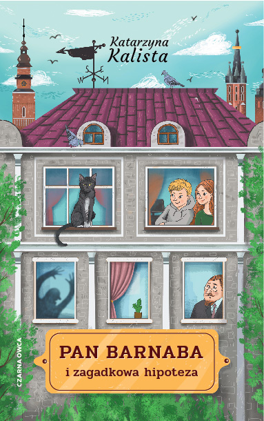

# Pan Barnaba     
------------------------------------------------

## Table of contnets
* [General Info](#general-info)
* [Content](#content)
* [Way of Working](#way-of-working)
* [Technologies](#technologies)
* [Contact Info](#contact-info)
* [Project Status](#project-status)

## General info
* website project for kids book "Pan Barnaba i tajemnicza hipoteza". Author - Katarzyna Kalista (my wife)
    * this site has to support book promotion 
    * target group - kids 8 to 10 years old
* site includes simple logic games, quizes and info about book and author
* include also kind of forum where users can share oppinnion about book and website
* website [www.panbarnaba.pl](https://panbarnaba.pl) should start at April 2021
* book premier planned at **14th of April 2012**
* this is my final project "Python Developer" course in coderslab.pl 

## Content
* panbarnaba.pl/intro - overview of application in scrolling ribbon
* info - baisc information about author, books and publisher - static page
* games - a few games for kids (sudoku, puzzle, encrypting, quiz)
* maths - a few interesting algorithm visualisation (gameOfLife, Fractals, Labirynth)
* forum - interaction between users
* price info - every day web search for actual pricelist (traditional book and ebook)
* news - information about book or author (link to internet source)
* contact - user can send the message to author.

## way of working
* the idea is that Pan Barnaba (the cat) is tour gide of website. On main subsites in the bubble is message from Pan Barnaba to introduce and explain what can bo done in this part of application
* main banner shows counter to premier
* every game site count the user time. Result can be save in data base and compare with other players
* every algirithm site easly explain how algorithm works. User can manipulate settings to see effect in real time

## Technologies
* python 3.8
* django
* numpy
* pandas 
* pytest
* pytest-django
* django-inlinecss
* finally not used, but tested
    * selenium
    * webdriver_manager

* you can use `requirements.txt` to install all technologies

## Contact info
* project designed and developed by Piotr Kalista
* email: pjkalista@gmail.com
* you can also write to Pan Barnaba: kontakt@panbarnaba.pl

## Support
* graphic - [Magdalena Toczydłowska-Talarczyk](https://issuu.com/magdatt/docs/portfolio)
* www graphic - [Magda Babul](https://www.behance.net/magdabaluladf9?fbclid=IwAR27HoWW0w1BfcbuUqQw5ldx_Ns_lftGZRpluwJ3FwnWvBK8yMRoaF-IcbY)

## Project status
- [x] kick off (2020/11/20)
- [x] design a draft www (Dec 2020)
- [x] testing functionality and correction (Jan-Feb 2021)
- [x] design/graphics finalisation (Jan-Mar 2021)
- [x] testing and run production server (end of Mar 2021)
